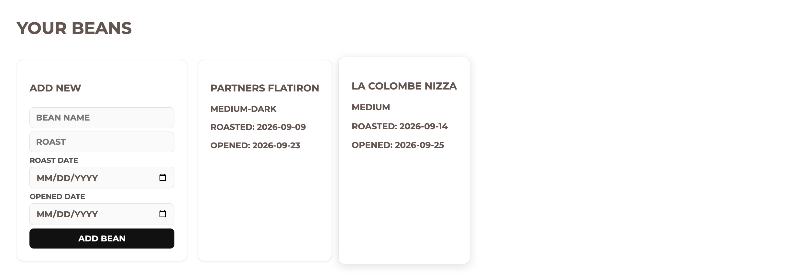
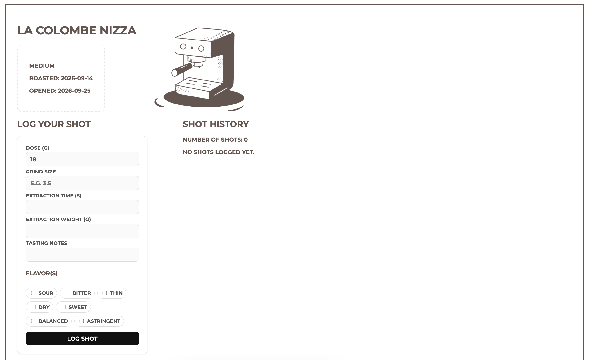
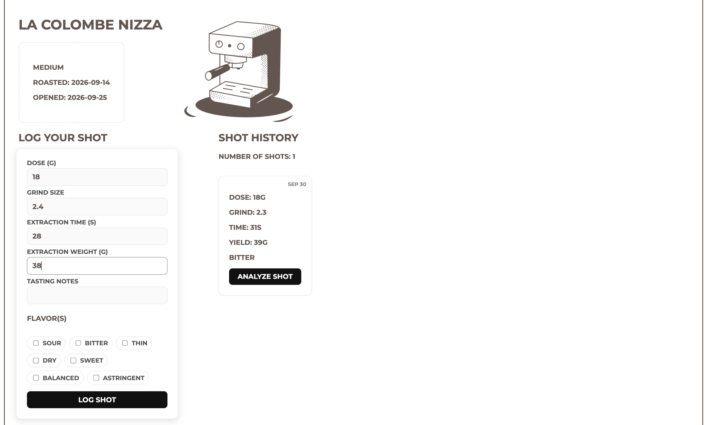
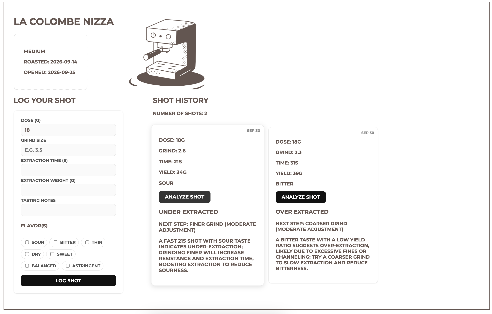

# goodspro

Think about your git logs, but for espresso.

Track how every espresso extraction pulls, see what's wrong and how you can perfect the formula to consistently get the perfect-tasting shot.

## Features

Users can keep track of all espresso beans and their profile in this gallery view.

Select an espresso bean profile to log specific extraction notes per shot pulled.

Specific extraction data such as dose, time, yield, and tasting notes are recorded. Every submission additionally logs the day.

Users can receive AI guidance on how to improve their next espresso extraction.

